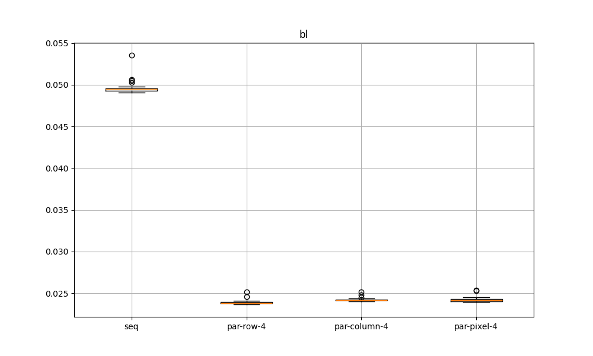
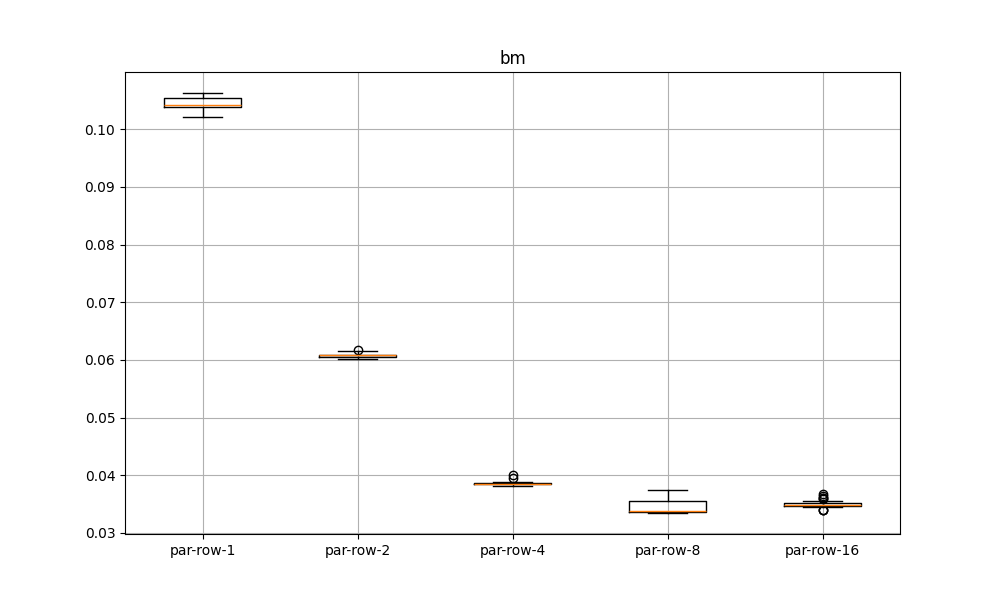
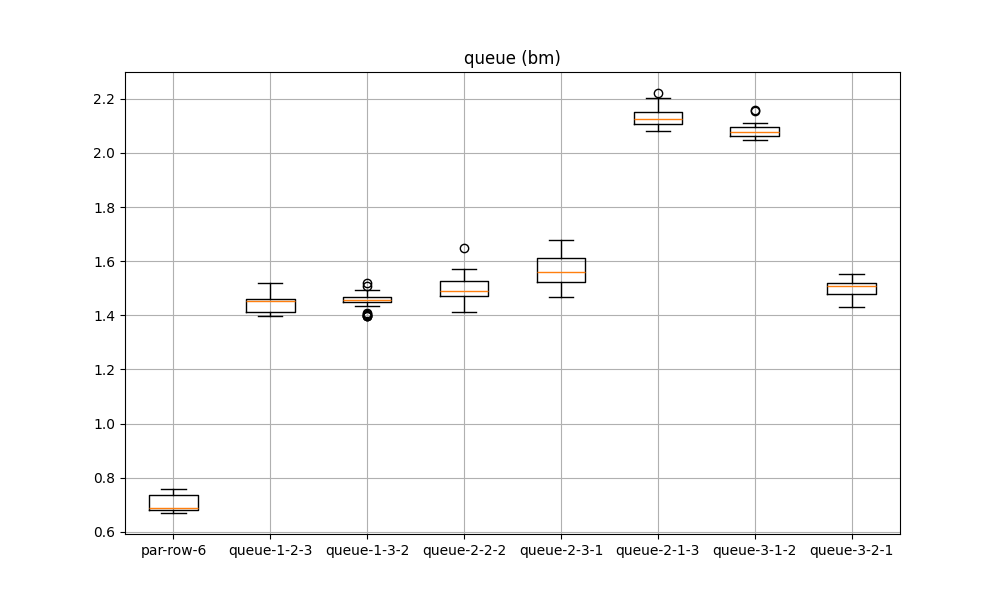

# bmp-conv

**bmp-conv** — library for bmp convolution. The library support *sequential* and *parallel* execution. It is also possible to run a sequential convolution with the *task queue* logic.
*Convolution* — operation where you take the sum of products of elements from two 2D functions, where you let one of the two functions move over every element of the other function.

# Build

```shell
./scripts/build.sh
```

# Usage

```shell
./build/src/main bmps/source/nature.bmp bmps/result/nature.bmp id 1 0 seq
./build/src/main bmps/source/nature.bmp bmps/result/nature.bmp id 1 0 par row 8
./build/src/main bmps/source bmps/result id 1 0 queue 2 2 2
./build/src/main bmps/source/nature.bmp bmps/result/nature.bmp id 1 0 gpu
```

# Test

```shell
./scripts/test.sh
```

> Required installed cmocka library.

## Performance test

```shell
./perf_test/.venv/bin/python3 perf_test/main.py
```

### Performance comparison

##### Comparasion of *sequential* and all modes *parallel* convolutions in the same bmp and options (filter, factor, bias)



`Plot 1` shows that any parallel implementation outperforms the sequential one two times. As for the best parallel mode, row - the fastest, column - the most compact.

##### Comparasion of *parallel* convolutions in the same bmp and options with different *number of threads*



`Plot 2` shows that then more threads there are, the faster. However, different between 4, 8 and 16 threads is not  as large as between 1, 2 and 4. The most compact case is the case with 4 threads.

##### Comparasion of sequential launch *parallel* and *queue* convolutions in the same bmps, options and 6 threads (in queue: readers + workers + writers)



`Plot 3` shows that the parallel implemenatation outperforms the queue with any variations. The best variation queue is variation with 3 worker threads, the worst variation queue is with 1 worker threads. As for the most compact variation queue, this is the variation "1-3-2".

> The number of library runs for each test case is 30. The time limit for each file is 2 seconds.

> All tests were performed on MacBook Air M1 on 09.06.2025 on eaa54d0ff181625caad49aa5d7a1ae1dec34406d commit.

## Thanks

Thanks [Mattflow](https://github.com/mattflow/cbmp?ysclid=m9104rn4ej835090391) for C library for reading, manipulating, and saving BMP images.

## License

Distributed under the [MIT License](https://choosealicense.com/licenses/mit/). See [`LICENSE`](LICENSE) for more information.
